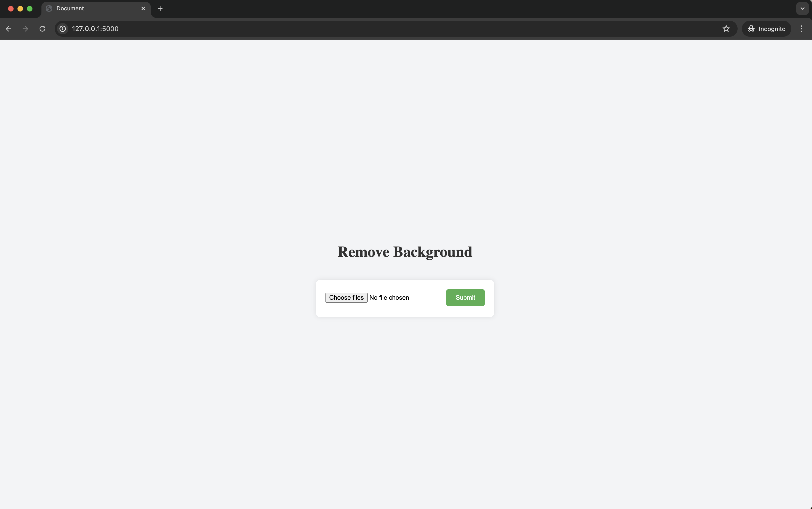

# Background Removal Web App

This is a Flask web application that allows users to upload images (.jpg, .png) and remove the background using the rembg library. The processed images are then zipped and made available for download.

## Getting Started

To run this application locally, follow these steps:

1. Clone this repository to your local machine:
2. Install the required dependencies: pip3 install -r requirements.txt
3. Run the Flask application: python3 app.py
4. Open a web browser and navigate to `http://localhost:5000` to access the application.

## UI Diagram

## Usage

1. Click on the "Choose File" button to upload an image file (supported formats: .jpg, .png).
2. Click on the "Submit" button to process the uploaded image and remove its background.
3. Once processing is complete, the processed images will be available for download as a zip file.

## Technologies Used

## Acknowledgments

Special thanks to the creators of the rembg library for providing the background removal functionality and Coding Shiksha for the coding tutorial.